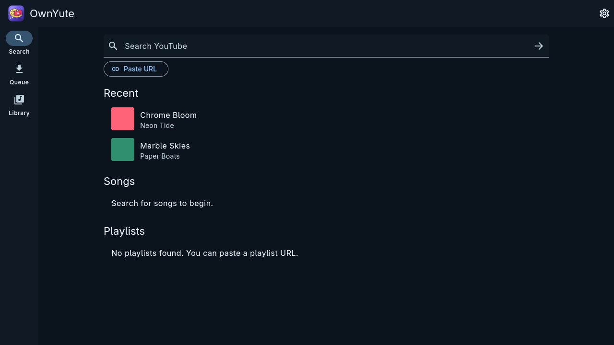
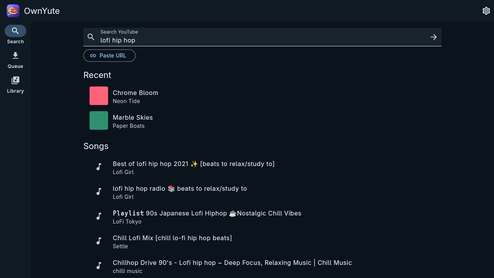
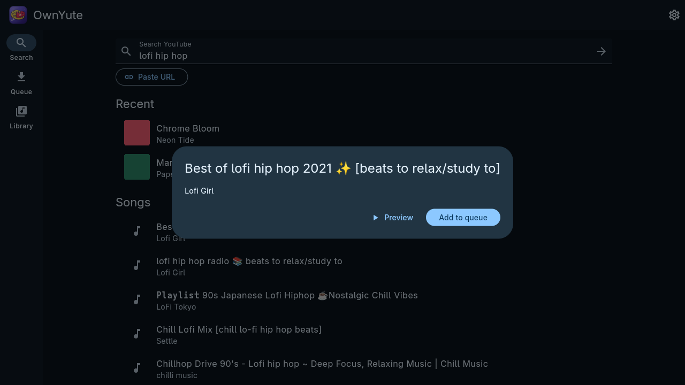
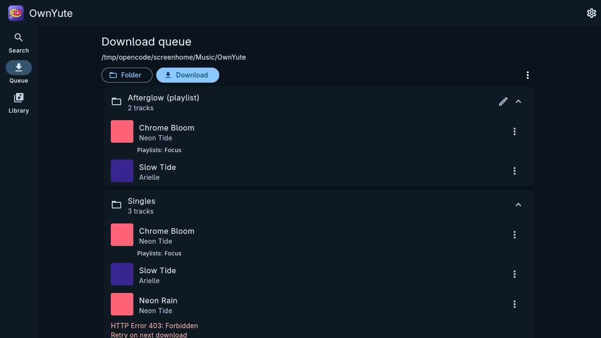
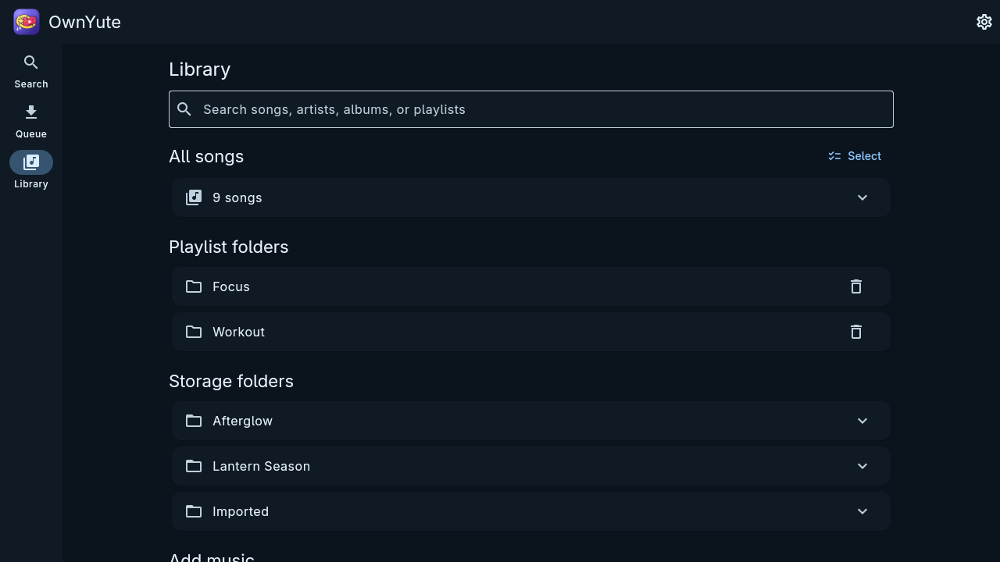
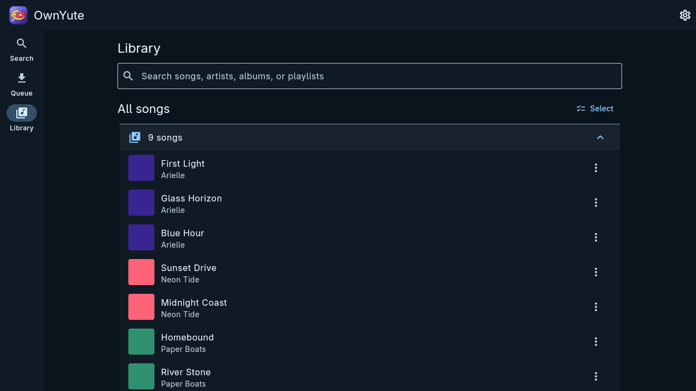
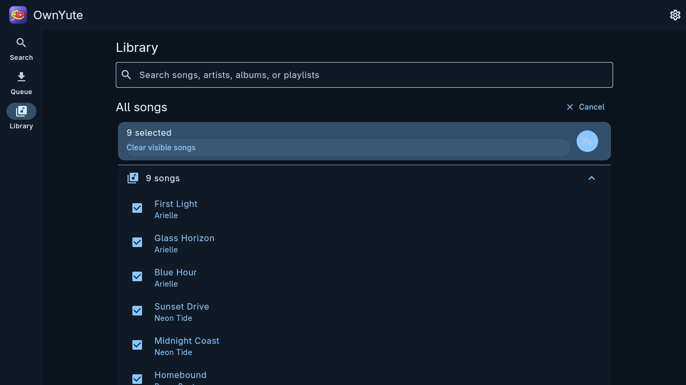
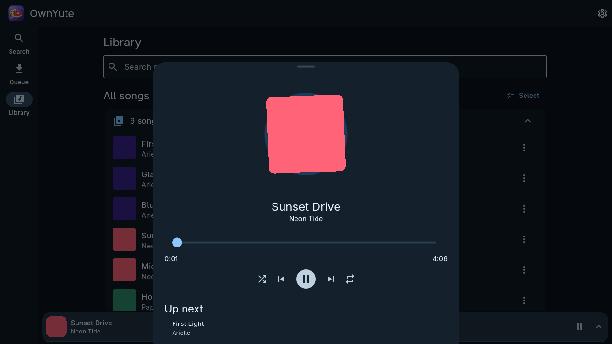
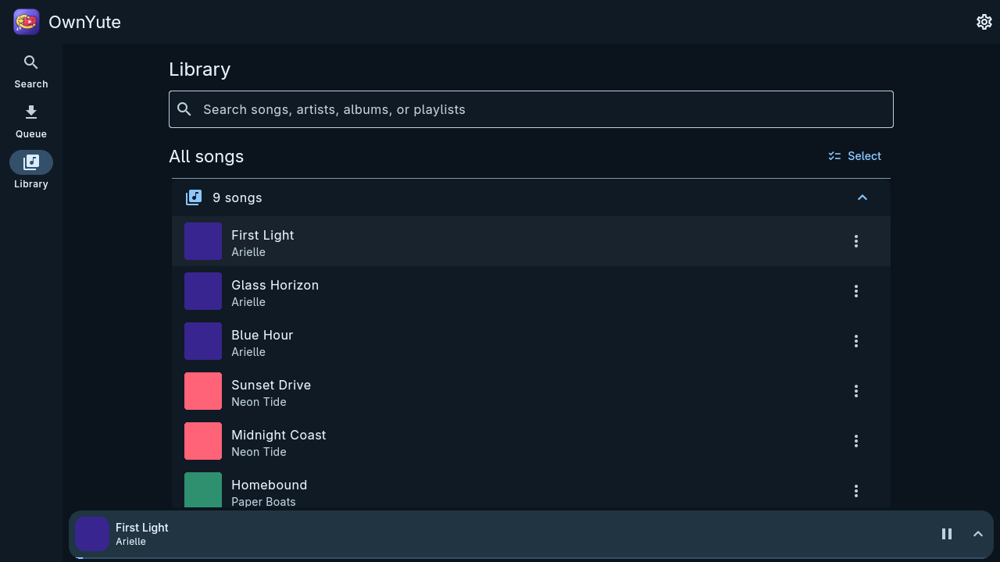
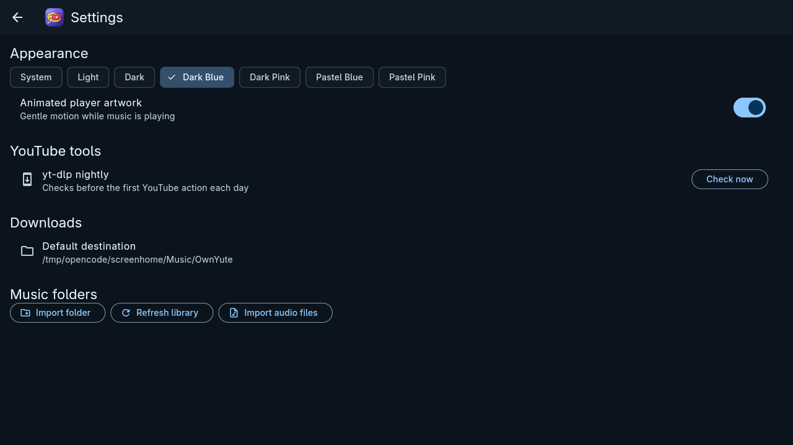

# OwnYute

**Own your music. Search, download, and organize YouTube music locally on Linux and Android.**

OwnYute wraps [`yt-dlp`](https://github.com/yt-dlp/yt-dlp) and FFmpeg in a native-feeling Flutter app. Search YouTube or paste a song or playlist URL, preview tracks, manage a persistent playback queue, save previews offline, and organize high-quality tagged MP3s in a local library. Your playback queue, Downloads list, recent tracks, library index, and settings survive a restart.



## Why OwnYute

- **Local ownership** — files stay in folders you choose, with metadata and artwork embedded in the files.
- **Best available quality** — downloads the best source audio and converts it to VBR MP3.
- **Cover art that travels with the file** — the source thumbnail (or an image you pick) is embedded as album/single artwork.
- **Resilient by design** — `yt-dlp` updates nightly and every update is validated with automatic rollback.
- **One app, two platforms** — the same experience on Linux desktop and Android, with native integration on each.

## Screenshots

### Search and add

Search your downloaded library and YouTube from one bar, or use **Paste URL** for a song or playlist. Tap a result to preview or queue it. With an empty search, the dashboard shows your recently played tracks in a horizontal row plus your playlist and storage folders; folder tiles open their contents on a dedicated page.

| Search results | Track actions |
| --- | --- |
|  |  |

### Downloads

Batch downloads are grouped and collapsible; individual additions appear under **Singles**. Failed items stay in the queue for retry.



### Library

**All songs** starts collapsed, followed by virtual playlist folders and physical storage folders. Folder tiles open a dedicated page with their tracks, and a long press there selects songs in that folder on its own. Use **Select** (or a long press on any song) to pick several songs, then add them to a playlist or delete them together. The library search is limited to downloaded songs and shows only matching results.

| Library | All songs expanded | Multi-select |
| --- | --- | --- |
|  |  |  |

### Player

A persistent mini player while you browse, with a polished expanded view for seek, previous/next, shuffle, repeat, and a reorderable playback queue. The queue reads as *what plays from here*: the current song is pinned at the top and marked **Now playing**, and a song leaves the list once it finishes, with the header counting what is left and what has played. **Previous** steps back through recently finished songs even though they are no longer listed, **Repeat** starts the set over when the queue runs out, and the rest of the list can still be dragged into a new order. None of this touches the separate Downloads list. A streamed preview also offers **Save offline**, which adds it to Downloads and opens that tab without creating duplicates.

| Expanded player | Mini player |
| --- | --- |
|  |  |

### Themes

Seven color schemes, including complementary dark blue and dark pink.



## Rows and row actions

Every list of songs uses the same row: artwork, a scrolling title and artist, and
one or two buttons on the right.

- **Long titles scroll.** A title that does not fit travels sideways, pauses at
  each end, and starts again. It stops while you hold the row, and it becomes a
  plain ellipsis if the system asks for reduced motion.
- **On a phone, swipe a row left** to slide it aside and reveal its actions. Past
  about half the strip it stays open; a shorter swipe springs back. Pulling
  further than the strip is open resists like a rubber band instead of running
  off, and **any scroll snaps an open row shut** so it never rides along
  displaced. A vertical swipe still scrolls the list.
- **On desktop, every row has a `⋮` menu** with the same actions, so nothing
  depends on discovering a gesture. The swipe also works with a mouse or
  trackpad.
- **What is where:** library songs, folder pages and library search matches offer
  *add to playback queue, add to playlist folder, refresh artwork, edit metadata,
  move file, delete song*. Search results pin a download button (which turns into
  a disabled "already queued" button) and offer *add to playback queue* and
  *preview*. Download-queue rows offer *edit metadata, add to playlist folder, add
  to playback queue, remove from group*. Folder pages put *refresh artwork* and
  *delete folder* behind a `⋮` in the app bar, and the storage folder list has the
  same two behind its trailing `⋮`.
- **A single pinned button** is the only always-visible action, and only on search
  results.

## Linux setup

Install Flutter with Linux desktop support, `yt-dlp`, and `ffmpeg` (including `ffplay`). SQLite is bundled by the Dart package. On Debian or Ubuntu, for example:

```sh
sudo apt install ffmpeg yt-dlp
flutter pub get
flutter run -d linux
```

On x64 and arm64 Linux, OwnYute checks for a nightly `yt-dlp` release before the first YouTube operation and at most once every 24 hours. It downloads a verified executable into the app support directory and uses that copy for search, previews, and downloads. The system `yt-dlp` on `PATH` is used until an app copy is available. A failed check keeps using the last working copy, or the system executable if none was installed. `ffmpeg` and `ffplay` must remain on `PATH`.

## Android setup

The Android app supports Android 7 (API 24) and later on arm64 phones and x86_64 emulators. Install Flutter and the Android SDK, then connect a device or start an emulator:

```sh
flutter pub get
flutter devices
flutter run -d <device-id>
# Or build an APK:
flutter build apk
```

Android bundles `yt-dlp` and FFmpeg through [youtubedl-android](https://github.com/yausername/youtubedl-android). The app needs internet access for search, previews, artwork, and downloads. The first use of Android's folder picker grants OwnYute access to that folder through the Storage Access Framework; select a download folder from Downloads or Settings and select existing music folders from Library. Access is saved across restarts. If a folder is moved, removed, or access is revoked, choose it again. Individual imported audio files are copied into the app's `Imported` folder. Playback uses an Android foreground service with a media notification; on Android 13 and later, allow notifications to show its controls. The bundled Android tool library is GPL-3.0 licensed, which matters when distributing modified APKs.

Before the first YouTube operation each day, Android checks the nightly `yt-dlp` channel. If the update fails or the device is offline, the bundled or previously updated version remains available. Settings shows update errors and has **Check now** for a manual retry. Automatic updates cannot guarantee that YouTube will always work when the site changes.

The Android updater checks that the installed tool runs before and after updating. If the nightly update fails validation, it restores the previous working tool or the bundled copy. Settings also has **Build and crash report**; tap its copy button after relaunching the app to share the app version, last tool step, and any recorded error. The report removes YouTube URLs and storage paths. Install the latest APK over an existing installation to keep app data when investigating a crash.

The current release build uses Flutter's debug signing key so it can be installed for testing. Configure your own Android signing key before publishing.

## Use

1. Search from Search, or use **Paste URL** for a YouTube song or playlist. Playlist results open a track picker with **Select all**. Tap or long-press a row to choose it, then either **Preview selected** to listen to just those songs in order, or **Add selected** to queue them for download.
2. Preview a track with the play button. The mini player remains visible while browsing. Its expanded view provides seek, previous/next, shuffle, repeat, and the playback queue. The playing song sits at the top of that queue and finished songs drop off it, so it lists what is still to come; **Previous** goes back through what already played. Append a song to the queue from its row actions, which confirms with a short message, then drag or remove entries in the expanded player. Playback order and the current paused track survive a restart. A remote preview can be sent to **Downloads** with **Save offline**. Drag the seek slider and release to jump once; the player shows buffering and pauses the time bar while loading. Android plays local and streamed tracks through its background media service.
3. Add tracks to Downloads. Long song titles scroll sideways so the whole name stays readable on a phone. Each **Add selected** action creates a collapsible batch; individual additions appear in **Singles**. A song shared by batches downloads once and appears in each batch. Use a queued song's menu to assign it to an existing or new virtual playlist folder before downloading. Edit a batch with its pencil button, or use the top menu to edit all queued items, cancel downloads, or **Clear finished items**. Clearing finished items leaves saved files and Library entries intact. Choose a destination and an optional physical folder. Existing files prompt **Skip**, **Replace**, or **Keep both**.
4. Downloads run sequentially. OwnYute requests the best available source audio and source thumbnail, converts the audio to high quality variable bitrate MP3 with FFmpeg, and writes title, artist, album, and the album/single cover. User-selected artwork takes priority. Artwork retrieval and embedding are best-effort, so an unavailable or unsupported cover does not prevent the music from being saved. Failed or interrupted items remain in the queue for retry.
5. Library starts with **All songs** collapsed, followed by virtual **Playlist folders**, physical **Storage folders**, and the **Import folder** / **Import audio files** actions. Search by song, artist, album, or playlist. Use **Select** above All songs to expand the list, choose several visible tracks, and add them to one existing or new playlist folder. Downloaded playlist tracks are assigned to their source playlist folder, and the same saved file can appear in multiple playlist folders. Use a song's row actions to add existing music to a playback queue or a playlist folder, look up its cover art again, edit metadata, choose local JPG, PNG, or WebP cover artwork (or enter an image URL), move its file, or delete it from storage and the app. Selecting songs shows a bar with **N selected** plus **add to playlist** and **delete**: the delete confirmation names every song that also lives in a playlist folder, because deleting a file removes it from those folders too, and a progress line runs while the files are being removed. Deleting a storage folder asks the same question twice: **Remove from library** only forgets the songs and leaves the audio on disk, while **Delete files** also removes them from the device, and the dialog names the songs shared with a playlist folder. Deleting an imported folder also stops scanning it, so a later refresh does not bring the songs back. The delete button on a playlist folder deletes all its member audio files and library entries, including songs shared with other playlists, after confirmation. Metadata editing briefly stops playback of that song and resumes near the previous position. A failed edit leaves the library entry and original audio in place.
6. Choose **System**, **Light**, **Dark**, **Dark Blue**, **Dark Pink**, **Pastel Blue**, or **Pastel Pink** in Settings. Animated player artwork can be disabled and follows the device's reduced motion setting. Automatic missing-artwork lookup is also optional and enabled by default. It checks songs sequentially with conservative title/artist matching; a found cover updates the Library display and is embedded into existing audio. You can also run the same search on demand from a song's **refresh artwork** action, or over a whole folder from a folder's `⋮`, and the library-wide **Find now** in Settings still does every missing song. Artwork lookup and embedding are best-effort and never block playback or downloads. The layout adapts from phone navigation to a wider desktop rail.

## Development checks

```sh
flutter analyze
flutter test
flutter build linux
flutter build apk
```

Offline checks run with `flutter test tool/verify_services_test.dart`, `flutter test tool/verify_database_test.dart`, and `flutter test tool/verify_download_test.dart`. The download check requires FFmpeg and FFprobe. Flutter unit tests are in `test/`.

## Branding assets

The editable logo master is `assets/branding/ownyute_logo.svg`. Android launcher icons and the Linux window icon are generated from it. Install `rsvg-convert` (`librsvg2-bin` on Debian or Ubuntu), then regenerate every size with:

```sh
tool/generate_app_icons.sh
```

Android includes legacy, adaptive, round, and monochrome themed icons. Linux builds bundle the GTK window icon, a desktop entry, and standard hicolor assets for packaging.

## Documentation

Full technical documentation lives in [`docs/`](docs/README.md):

- [Tech Stack](docs/tech-stack.md)
- [Architecture](docs/architecture.md)
- [Folder Structure](docs/folder-structure.md)
- [Aim and Achievements](docs/aim-and-achievements.md)
- [Data Model](docs/data-model.md)
- [Platform Integration](docs/platform-integration.md)
- [Build and Release](docs/build-and-release.md)
- [Testing](docs/testing.md)
- [Troubleshooting](docs/troubleshooting.md)

## Verification checklist

For Android verification, use a connected device to search, open a song URL (including a radio mix watch URL), preview it, download it, and play the downloaded MP3. Import and play a known-good MP3 separately, then repeat playback after restarting the app. If a step fails, copy **Build and crash report** from Settings after reopening the app. Capture `adb logcat -d -v time` when ADB is available.

## License notes

OwnYute orchestrates `yt-dlp` and FFmpeg. The bundled `yt-dlp`, FFmpeg, Python, and `youtubedl-android` components carry their own licenses (FFmpeg and `youtubedl-android` are GPL-family), which matters when distributing modified builds. Ensure you have the right to download the content you choose.
